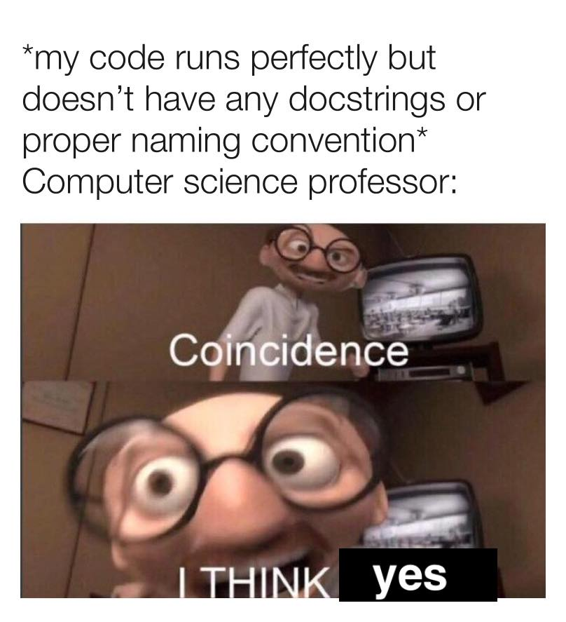

# Tutorial 4 Notes

## More notes at https://cgi.cse.unsw.edu.au/~cs1511/19T2/tut/04/questions

## Any questions?

## Common problems/noteworthy points

* Weekly test due this afternoon
* Assignment 1 is out - we will cover it
* Check your email for the link to the code
* ```num1 < num2 < num3```
* Code review - countdown.c
* Help sessions

## What is CS Paint?

## How does CS Paint store a canvas and how can you access a single pixel?

## Draw a 2D grid on a piece of paper or the whiteboard and decide which cells would be coloured in CS Paint with the following commands:

* 1 1 1 1 6
* 2 2 2 5 4

## Do you need code that adheres to the style guide?

<details>
<summary>
Answer
</summary>



</details>

## Code review time!

##  Discuss the errors in these while loops 

```c
int i;

while (i < 100) {
    printf("%d\n", i);
    i = i + 1;
}
```

<details>
<summary>
Answer
</summary>

```i``` is not initialised so it will take on the value that is already in memory. To fix this initialise ```i```.

</details>

```c
int i = 0;
int j = 0;

while (j = 1 || i < 100) {
    printf("%d\n", i);
    i = i + 1;
}
```

<details>
<summary>
Answer
</summary>

```j``` is never changed. This is a code smell and indicates something is wrong with the code.

</details>

```c
int i = 0;
int n = 10;
while (i < n) {
    printf("%d\n", i);
    n = n + i;
    i = i + 1;
}
```

<details>
<summary>
Answer
</summary>

```n``` grows at a much faster rate than ```i``` meaning that the condition that ```i < n``` will always be true. 

</details>

```c
int i = 0;
while (i < 10)
    printf("%d\n", i);
    i = i + 1;
```

<details>
<summary>
Answer
</summary>

This involves a shorthand for while loops. When curly brackets are omitted the direct next line after the while condition is only run. Therefore this loop will always print 0. To fix it add back in curly brackets.

</details>


## What is an array? How do we define an array?

<details>
<summary>
Answer
</summary>

An array is a collection of elements with the same data type. Each element is accessed providing the name of the array and an index. The index range is from 0 through to N-1, where N is the number of elements in the array. This is also known as zero-based indexing.

</details>

## Give an expression that sums the first and third element of an array called numbers

<details>
<summary>
Answer
</summary>

```c
    numbers[0] + numbers[2]
```
Note third element is accessed using ```numbers[2]``` since C uses zero based indexing.

</details>


## If an array is declared as ```int numbers[20];``` and your program assigns a value to each element in the array, what is the problem with the statement ```x = numbers[20];``` ?

<details>
<summary>
Answer
</summary>

Because arrays use zero-based indexing, accessing the element indexed 20 is accessing the 21st item in the array. This will access a value that is not within the boundaries of the array.
Behaviour of a program that does this is undefined and it is possible, for example, that it will cause the program to terminate. Sometimes it will retrieve the value of another variable.

</details>

## Tutorial question 9 - squares.c

Write a c program that stores in each index the square of the index and then prints them.

For example:

```c
    $ ./squares
    How many numbers would you like to count up to? 5
    In index 0, we have 0
    In index 1, we have 1
    In index 2, we have 4
    In index 3, we have 9
    In index 4, we have 16
```

## Tutorial question 11 - asterisks_line.c

Write a program that reads in an integer and prints out that many asterisks, each on a new line.

```c
    $ ./asterisks
    Please enter an integer: 5
    *
    *
    *
    *
    *
```

## Tutorial question 12a - square.c

Write a c program to scan a number and then print a square of ```n``` by ```n``` asterisks

For example:

```c
    $ ./square
    Enter an integer: 5
    *****
    *****
    *****
    *****
    *****
```

## Tutorial question 12b - diagonal.c

Write a c program to scan a number `n` and then print a diagonal line of asterisks on a square of `n` by `n` underscores

For example:

```c
    $ ./diagonal
    Enter an integer: 10
    *---------
    -*--------
    --*-------
    ---*------
    ----*-----
    -----*----
    ------*---
    -------*--
    --------*-
    ---------*
```

## Tutorial question 12b - x.c

Write a c program to scan a number `n` and then print two diagonal lines of asterisks on a square of `n` by `n` underscores

For example:

```c
    $ ./diagonal
    Enter an integer: 10
    *--------*
    -*------*-
    --*----*--
    ---*--*---
    ----**----
    ----**----
    ---*--*---
    --*----*--
    -*------*-
    *--------*
```

## Tutorial question 12c - triangle.c

Write a C program to scan in a number `n` and then print two triangles that form a square of `n` by `n`

For example:

```c
    $ ./triangle
    Enter an integer: 5
    ----*
    ---**
    --***
    -****
    *****
```

## Tutorial question 12d - bars.c

Write a C program to scan in a number `n` and then print a square of `n` by `n` square of vertical bars of alternating hashes and asterisks.

For example:

```c
    ./bars
    Enter an integer: 9
    -*-*-*-*-
    -*-*-*-*-
    -*-*-*-*-
    -*-*-*-*-
    -*-*-*-*-
    -*-*-*-*-
    -*-*-*-*-
    -*-*-*-*-
    -*-*-*-*-
```